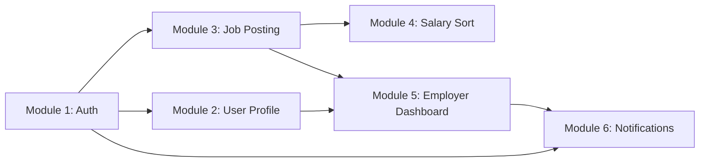

# JobLink Project Status & Module Tracking

This document tracks all active modules, pull requests, dependencies, and integration status for JobLink.

---

## 📊 Modules & Pull Request Overview

| Module | Owner | Branch | PR | Status | Depends On |
| :--- | :--- | :--- | :---: | :---: | :--- |
| **Module 1: Authentication & Authorization** | [@Noreen73](https://github.com/Noreen73) | `feature/auth` | [#1](https://github.com/Ammar-creater/JobLink/pull/1) | Merged (squash) | *None (Base Module)* |
| **Module 2: User Profile Management** | [@Noreen73](https://github.com/Noreen73) | `feature/user-profile` | [#2](https://github.com/Ammar-creater/JobLink/pull/2) | Merged (2c10817) | `Module 1 (feature/auth)` |
| **Module 3: Job Posting CRUD, Search, Filters & UI** | [@emanashrafch1212-hue](https://github.com/emanashrafch1212-hue) | `feature/job-posting` | [#3](https://github.com/Ammar-creater/JobLink/pull/3) | Merged (803545e) | `Module 1 (feature/auth)` |
| **Module 4: Numeric Salary Sort & Filters** | [@emanashrafch1212-hue](https://github.com/emanashrafch1212-hue) | `feature/job-search` | [#7](https://github.com/Ammar-creater/JobLink/pull/7) | Merged (9dafb9d) | `Module 3 (feature/job-posting)` |
| **Module 5: Employer Dashboard & Applications** | [@Noreen73](https://github.com/Noreen73) | `feature/employer-dashboard` | [#4](https://github.com/Ammar-creater/JobLink/pull/4) | Merged (aff3edd) | `Module 1 (feature/auth)`, `Module 3 (feature/job-posting)` |
| **Module 6: Notifications** | [@Noreen73](https://github.com/Noreen73) | `feature/notifications` | [#12](https://github.com/Ammar-creater/JobLink/pull/12) | Merged (1d19067) | `Module 1 (feature/auth)`, `Module 5 (feature/employer-dashboard)` |

---

## 🔀 Recommended Merge Sequence

1. **Module 1 (PR #1):** Core `User` model, JWT authentication, and authorization middleware.
2. **Module 2 (PR #2):** Profile management and file upload handling.
3. **Module 3 (PR #3):** Job posting management and public browsing UI (uses `User` model & auth from Module 1).
4. **Module 4 (PR #7):** Numeric salary sorting and filters (uses `JobPosting` from Module 3).
5. **Module 5 (PR #4):** Employer dashboard and application reviews (uses `User` from Module 1 and `JobPosting` from Module 3).
6. **Module 6 (PR #12):** Notifications on application status changes (uses `User` from Module 1 and `Application` from Module 5).
